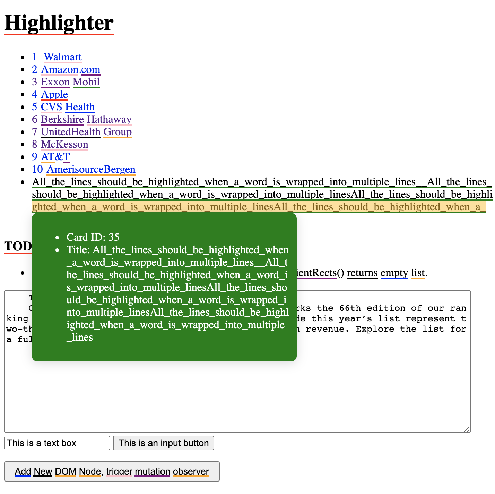

# dom-highlight-lib


Highlight tokens on the DOM like the Grammarly.
Inspired by [Making Grammarly Feel Native On Every Website](https://www.grammarly.com/blog/engineering/making-grammarly-feel-native-on-every-website/).



## Install

```sh
yarn add dom-highlight-lib
# or
npm install --save dom-highlight-lib
```

## Usage

1. Define an asynchronous `match` function that accepts an array of strings and returns an two-level array of tokens (the keywords found in the input strings).
   - For each input string, the function should return an array of tokens.
   - The order of returned two-level array should be same to the order of the input strings, so that we could tell what tokens are returned for a specific input string.

    ```js
    // for example
    let id = 0;
    const regex = /\w+/mg
    const match = (texts) => new Promise((resolve) => {
      const tokenize = (text) => {
        const tokens = [];
        let m = regex.exec(text);
        while (m !== null) {
          tokens.push({
            id: `${id}`,
            color: `#ff0000`,
            start: m.index,
            end: m.index + m[0].length,
            keyword: m[0]
          });
          id += 1;
          m = regex.exec(text);
        }
        return tokens;
      };

      resolve(texts.map(tokenize));
    });
    ```

2. Decide what to do when the user mouse hover on a highlight.

    ```js
    // for example
    const tokenView = document.createElement('div');
    tokenView.style.color = '#fff';
    tokenView.style.borderRadius = '8px';
    tokenView.style.boxShadow = '0 2px 15px 0 rgba(68, 70, 73, 0.2)';
    tokenView.style.padding = '10px';
    tokenView.style.position = 'absolute';
    tokenView.style.width = '362px';
    tokenView.style.zIndex = '2147483647';
    document.body.appendChild(tokenView);

    const showToken = (token, rect, event) => {
      tokenView.style.background = token.color;
      tokenView.style.top = `${rect.top}px`;
      tokenView.style.left = `${rect.left}px`;
      tokenView.innerHTML = `<ul><li>ID: {token.id}</li><li>Title: {token.keyword}</li></ul>`;
      tokenView.style.display = 'block';
    };

    const hideToken = (token, rect, event) => {
      tokenView.innerHTML = '';
      tokenView.style.display = 'none';
    };
    ```

3. Optionally, provide below parameters:
   - `minBatchTextLength`: controls how often to invoke the `match` function according to the total number of characters in the strings. Defaults to `1000`.
   - `className`: the CSS class name for the highlights container. Defaults to empty string.
   - `throttleUpdates`: Throttle highlight updates, update at most once every specified milliseconds. Defaults to `500`ms.

4. Start the highlighter.

    ```js
    // for example, on a web page
    const highlighter = require('dom-highlight-lib');
    highlighter.start(
      match,
      showToken,
      hideToken,
      1000, // minBatchTextLength
      'highlights', // className
      500 // throttleUpdates
    );
    ```

    > The highlighter now scans and monitor changes (`scroll`, `resize`, and `MutationObserver`) on the web page, and update highlights when necessary.

## TODO

- `textarea` and `input` controls are not supported because `Range.getClientRects()` returns empty list.
- Because the `match` function is asynchronous, it possible for the highlighter to run into an inconsistent state when DOM changes frequently.
